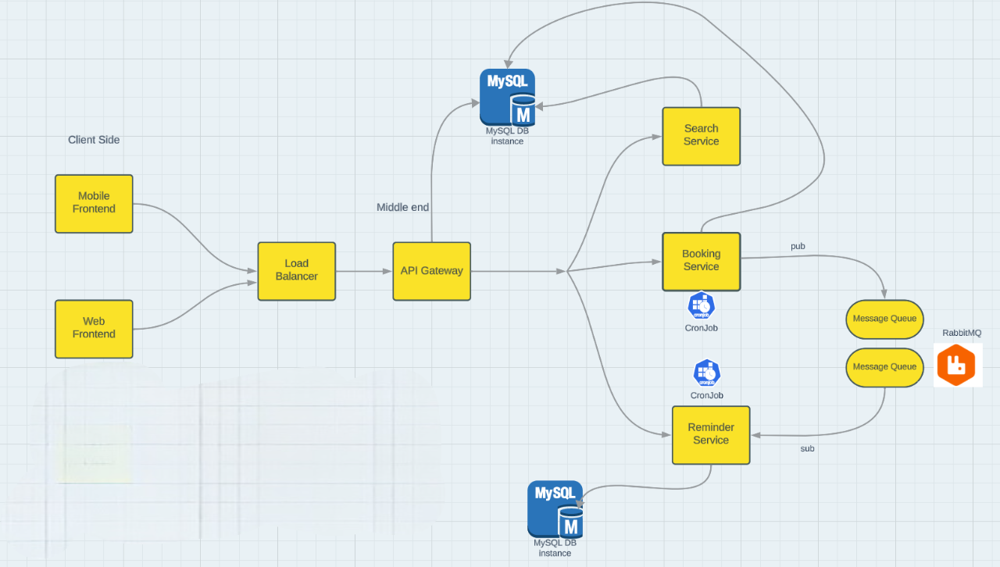

AirwayAPI is a comprehensive RESTful microservices backend for a flight booking system. It provides a robust and scalable solution for managing flight searches, bookings, and notifications.
Microservices
1. Flights Search Service

Implemented using Node.js and Express
Utilizes MySQL database with Sequelize ORM for efficient data management
Provides robust filtering and sorting capabilities for flight searches
Optimized queries ensure fast response times even with large datasets

2. Flights Booking Service

Built with Node.js and Express, interfacing with MySQL via Sequelize
Implements concurrent booking system using SQL transactions with appropriate ISOLATION LEVELS
Ensures data integrity and prevents overbooking through careful transaction management
Handles edge cases such as last-minute cancellations and reservation timeouts

3. Notification Service

Developed using Node.js with Express for RESTful API endpoints
Integrates Nodemailer for reliable email delivery
Sends transactional emails for booking confirmations, cancellations, and updates
Implements queuing system to handle high volume of notifications during peak times

4. API Gateway

Acts as a single entry point for all client requests
Handles Authentication and Authorization using JWT (JSON Web Tokens)
Implements forward proxy to route requests to appropriate microservices
Utilizes reverse proxy capabilities for enhanced security and load balancing
Provides additional features such as rate limiting and request/response transformation

## High Level Design

Tech Stack

Node.js
Express.js
MySQL
Sequelize ORM
JSON Web Tokens (JWT)
Nodemailer
